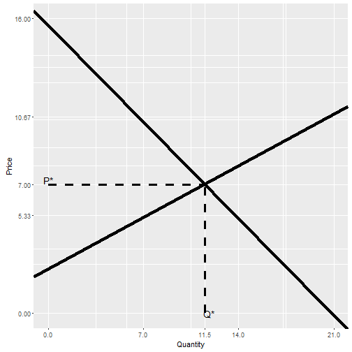

## Supply and demand curve

In microeconomic theory supply and demand curves are ubiquitous. For the Course assignment I have created an app that generates Marshallian Cross of supply and demand given inverse supply and demand curves.

The application generates plot with those two lines and also marks equilibrum price and quantity and provides them in numerical form under the graph.

--- .class #id 
## UI of the application

User interface of the application is pretty simple. The inverse supply and demand curves are linear functions of price given the quantity.
To generate them we need slope and the intercept of both functions.

$$price_{demand}=-\alpha x+\beta$$
$$price_{supply}=\gamma x+\theta$$

The user is asked to enter $\alpha, \beta, \gamma, \theta$ The application then uses that information to generate plots and finds the equilibrum price and quantity

--- .class #id &twocol
## Application output

*** =left
An example of the app output, the actual shiny app has input control to create graph with values that user wants. The app is available at following [URL](https://upsidedownride.shinyapps.io/Developing_data_products)

*** =right
 

--- .class #id 

## Code used to generate plot on previous page. 


```r
demand_slope <- -0.75
demand_intercept <- 15.625
supply_slope <- 0.4
supply_intercept <- 2.4
max_y <- ceiling(demand_intercept)
max_x <- ceiling(-demand_intercept/demand_slope)
q_equilibrum <- solve(demand_slope-supply_slope,-(demand_intercept-supply_intercept))
p_equilibrum <- demand_slope*q_equilibrum+demand_intercept
ggplot(data=NULL,aes(x=x,y=y))+
      geom_abline(aes(intercept=demand_intercept,slope=demand_slope),size=1.5)+
      labs(x='Quantity',y='Price')+
      geom_abline(aes(intercept=supply_intercept,slope=supply_slope),size=1.5)+
      geom_segment(aes(x=q_equilibrum,y=0,xend=q_equilibrum,yend=p_equilibrum),size=1.2,linetype=2)+
      geom_segment(aes(x=0,y=p_equilibrum,xend=q_equilibrum,yend=p_equilibrum),size=1.2,linetype=2)+
      scale_x_continuous(breaks=c(q_equilibrum,round(seq(0,max_x,length.out=4),2)),limits=c(0,max_x))+
      scale_y_continuous(breaks=c(p_equilibrum,round(seq(0,max_y,length.out=4),2)),limits=c(0,max_y))+
      annotate('text',label='Q*',x=q_equilibrum+0.015*max_x,y=0,size=5)+
      annotate('text',label='P*',x=0,y=p_equilibrum+0.015*max_y,size=5)
```


